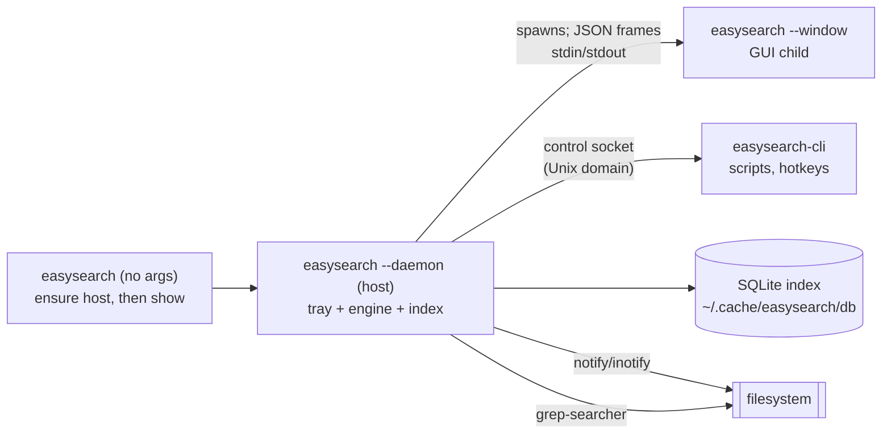

# Contributing to EasySearch

Thanks for wanting to help. EasySearch is a small, self-contained Linux desktop
app — realtime filename *and* content search with a native GUI, a tray, and no
network code at all. This guide gets you from a clean machine to a merged pull
request. If anything here is wrong or unclear, that is itself a bug worth
reporting (or fixing).

## What the project is

One binary, `easysearch`, is the whole app, run as a **background host** and the
**windows** it spawns. The host owns the system tray, the control socket and a
live index of the filesystem; each window is its child and asks the host for
searches over the child's stdin/stdout as newline-delimited JSON — so nothing is
ever exposed on a socket, a port or the network.

- **Realtime** — the kernel tells us about file changes (`notify`/inotify) and
  the index reflects them within about a second.
- **Filename search** — Everything-style glob/regex matching over the index.
- **Content search** — the embedded ripgrep engine (`grep-searcher`) reads files
  live, including the text layer of Word, OpenDocument and PDF files, all
  in-process.
- **Low footprint** — the index lives in SQLite on disk, not in RAM; idle CPU is
  ~0%.

Read [`docs/scope.md`](docs/scope.md) for the design and
[`docs/ui.md`](docs/ui.md) for the user-facing guide.

> **AI-assisted project.** Most of the code, tests and docs here were written by
> an AI coding agent under the maintainer's direction, and reviewed by a human
> before release. Reviews, corrections and second opinions are especially
> valuable — see *How to contribute* below.

## Architecture at a glance



- `easysearch-core` — all the logic: walker, watcher, matcher, content search,
  the SQLite/mmap index, the tag store, the freedesktop trash, config, and the
  engine protocol types.
- `easysearch-daemon` — the engine **server**: a library that serves the protocol
  (`serve`/`serve_reader`), plus the standalone `easysearch-daemon` binary for
  tests and headless use.
- `easysearch-gui` — the eframe/egui frontend (also usable as a standalone dev
  binary).
- `easysearch-app` + `app/` — the single `easysearch` binary: the launcher, the
  host (`--daemon`) and the window (`--window`).
- `easysearch-cli` — the headless CLI.

### Repository layout

| Path | What lives there |
| --- | --- |
| `core/src/` | `engine`, `watcher`, `walker`, `matcher`, `content`, `content_index`, `sqlite_index`, `disk_index`, `overlay`, `roots`, `tags`, `trash`, `config`, `proto`/`api`, `child`, `backend`, `ipc`, `logo` |
| `daemon/src/` | the engine server (`serve`/`serve_reader`, the `Op` dispatch) and the standalone engine binary |
| `gui/src/lib.rs` | the whole GUI (large — search it by feature) |
| `gui/src/tray.rs` | the StatusNotifierItem tray (served by the host) |
| `app/src/` | process entry points: `run_app` (launcher), `run_daemon` (host), `run_window` (GUI child), `run_engine`, `control_command` |
| `cli/src/main.rs` | the CLI |
| `packaging/` | desktop entry, AppStream metainfo, icons, deb/rpm/flatpak assets |
| `scripts/` | `install-deps.sh`, `package-*.sh`, `gen-cargo-sources.py` |
| `docs/` | design, GUI, config, protocol, storage and packaging docs |

Data flow for a query: the GUI sends a `Query` over its pipe to the host (or, in
the standalone dev binary, to an in-process `Backend::Local`); the host matches
against the SQLite index and/or the ripgrep engine and returns rows; the GUI
renders them, applying its own client-side overlays (tags, duplicate selection).

## Set up a dev machine

No root, no system Rust needed:

```sh
git clone git@github.com:mahmadmujtaba/easysearch.git
cd easysearch
./scripts/install-deps.sh     # user-local rustup + linker wiring + dev symlinks
```

The script installs a user-local Rust toolchain (rustup) and the libraries the
GUI links against, and points the linker at rustup's bundled `rust-lld` so no C
compiler is required. If you already have Rust **1.85+ (edition 2024)**, just
`cargo build` works.

Then get the usual loop going:

```sh
make check     # type-check the whole workspace
make test      # unit + integration tests
make clippy    # must be warning-free
make fmt       # rustfmt
make run-dev   # build and launch the app (host + window)
```

`make run-gui` runs only the window; `make daemon` drives the engine by hand
(JSON frames on stdin/stdout) — handy when debugging the protocol without a
display.

## How to contribute

### 1. Find something to work on

- **Good first issues** are labelled `good first issue` on GitHub; smaller
  `help wanted` items are a good next step. Open an issue (or comment on one)
  before starting anything large, so we can agree on the shape first.
- **Docs** are always welcome — a confusing paragraph is a real bug (see
  [`docs/pending.md`](docs/pending.md) for the known gaps).
- **Bugs**: reproduce it, then say which version, desktop (Wayland or X11) and
  what you did. `easysearch --version` prints the build.

### 2. Make the change

```sh
git switch -c my-fix          # branch off master
# ... edit ...
cargo fmt --all
cargo clippy --workspace --all-targets
cargo test --workspace
```

- **Commit style** — one logical change per commit, imperative subject
  (`engine: cap the content spool at 256 MB`), a short body explaining *why*.
  Match the surrounding history.
- **Tests** — add one when you fix a bug or add logic that can be tested
  without a display; `core` and the non-UI parts of `gui` have unit tests
  (`#[cfg(test)] mod tests`). Pure GUI code is verified by hand.
- **Don't reformat unrelated code** in the same change.

### 3. Open a pull request

Push your branch and open a PR against `master` with:

- **What** changed and **why** (link the issue).
- **How you tested it** (commands, and a screenshot for UI changes — dark and
  light themes look different).
- Any **follow-up** you deliberately left out.

CI builds a `.deb` and an `.rpm` only when a `v*` tag is pushed, and attaches
them to the GitHub release; pulls and pushes to `master` build nothing. Run the
packaging workflow by hand (Actions ▸ *packages* ▸ *Run workflow*) to check
packaging before you tag. The test suite is run by you, not CI, for now.

## Conventions worth knowing

- **Rust edition 2024**, `rustfmt`-formatted, `clippy` clean with
  `--all-targets`. Warnings are treated as failures in review.
- **No network, ever.** The app must not open sockets, phone home or self-update.
  Your change must keep it that way (the only socket is the local
  `$XDG_RUNTIME_DIR/easysearch.sock` control channel).
- **Never destroy user data.** The only mutation the app performs is moving
  files to the freedesktop **trash** (recoverable); anything else opens the file
  in the user's own app.
- **Keep it small.** Prefer the standard library and the crates already in
  `Cargo.toml`; a new dependency needs a good reason (the Flatpak build vendors
  every crate, so each one costs).
- **Keep memory low.** The index lives on disk; don't load whole trees into RAM.
  See `docs/scope.md` for the footprint budget.
- If you change a dependency, run `make cargo-sources` so the offline Flatpak
  build keeps working.

## Where to change what

| You want to… | Start in |
| --- | --- |
| Change how queries match | `core/src/matcher.rs`, `core/src/sqlite_index.rs` |
| Touch the index schema or storage | `core/src/sqlite_index.rs`, `core/src/disk_index.rs` |
| Add a config option | `core/src/config.rs` (+ the GUI dialog that edits it) |
| Change the engine protocol | `core/src/proto.rs`, `daemon/src/lib.rs`, `core/src/child.rs` |
| Add or change a GUI panel/action | `gui/src/lib.rs` (search for the feature) |
| Change install/packaging | `packaging/`, `scripts/package-*.sh`, `Makefile` |
| Document a feature | `README.md`, `docs/ui.md`, `docs/config.md` |

## Screenshots

`docs/screenshots/dark.png` and `light.png` are the images the README and the
AppStream metainfo point at. To re-take them after a UI change, run the app with
`HOME`, `XDG_CONFIG_HOME` and `XDG_CACHE_HOME` pointing at a scratch directory
holding a throwaway demo tree (not `XDG_RUNTIME_DIR`, where the Wayland socket
lives), set the theme in `$XDG_CONFIG_HOME/easysearch/gui.json`
(`{"theme":"dark"}` or `{"theme":"light"}`), drive the search with
`easysearch --search 2026`, then capture the *active* window (on KDE,
`spectacle -b -n -d 2 -a -o dark.png`). Keep the demo tree free of personal
filenames.

## Getting help

Open a GitHub issue or discussion — no question is too small. If you are unsure
whether an idea fits, open an issue and describe the problem you want to solve
before writing code; that is cheaper for everyone than a large PR that has to
change direction.

By contributing you agree your work is licensed under the project's
[MIT licence](LICENSE).
