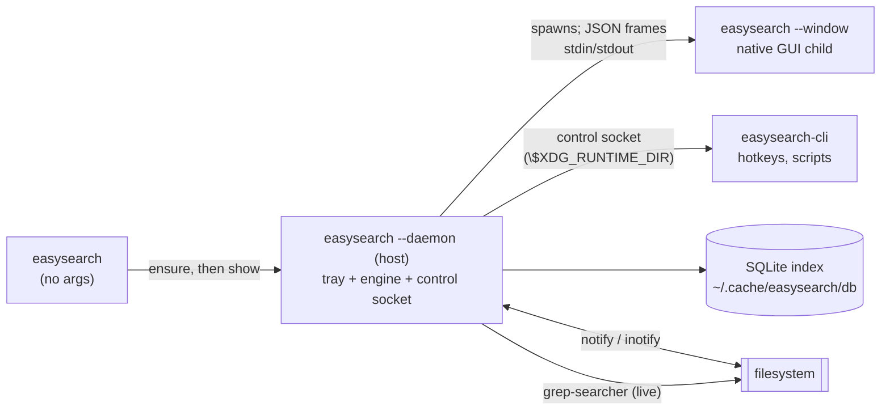

# EasySearch — design & architecture

What EasySearch is trying to be, how it is built, and the trade-offs behind the
main choices. For the user-facing guide see [`ui.md`](ui.md); for every config
key see [`config.md`](config.md). The engine protocol is in §7 below.

## 1. Purpose & non-goals

**Purpose.** A realtime, whole-filesystem filename *and* content search that
feels instantaneous and costs almost nothing while idle — a Linux answer to
VoidTools' *Everything*, with a native GUI and no web runtime.

**The one-sentence design.** A small Rust engine keeps a live **SQLite** index
of the filesystem, updated by kernel filesystem events, and answers content
queries with **ripgrep's engine embedded as a library** — so results are always
current, at the fastest speed available.

**Non-goals (explicitly not built):**

- A content **database** (Baloo/Recoll territory) — the embedded ripgrep engine
  reads live data, which is simpler and stays fresh.
- Binary content search (images, video, archives). Text, Word `.docx`, the
  OpenDocument family and PDF's text layer are searchable.
- Network filesystems as *roots* (skipped by default), and **any network access
  by the app itself** — no updater, telemetry or remote API.
- Editing, moving or deleting files from within the tool. The one exception is
  moving files to the **freedesktop trash**, which is recoverable.
- A web-based UI (electron/webview) — rejected by design.

## 2. Architecture

One binary, `easysearch`, is the whole app, and it runs as two kinds of
process: a **host** that owns the tray and the engine, and the short-lived
**windows** it spawns. The host starts detached (`easysearch --daemon`); each
window (`easysearch --window`) is its child, and they exchange newline-delimited
JSON frames over the child's stdin/stdout — no socket to the network, no port,
nothing reachable from outside the process pair.



| Crate | Role |
| --- | --- |
| `easysearch-core` | all logic: walker, watcher, matcher, content search, SQLite/mmap index, change overlay, roots/exclusions, tags, trash, config, protocol types |
| `easysearch-daemon` | the engine **server** library (`serve`/`serve_reader`, `Op` dispatch); the `easysearch-daemon` binary is the standalone engine for tests and headless use |
| `easysearch-gui` | the eframe/egui frontend (also a standalone dev binary) |
| `easysearch-app` + `app/` | the single `easysearch` binary: `run_app` (launcher), `run_daemon` (host), `run_window` (GUI child), `run_engine`, `control_command` |
| `easysearch-cli` | the headless CLI |

**Why a host process?** A window cannot be unmapped on Wayland and `winit`
refuses to recreate its event loop, so a window that is *closed* could not be
reopened inside one process. Putting the tray and the index in a host that
outlives any window is what makes "close the window" mean the window process
really exits — the window is gone, not parked — while indexing continues and the
index stays warm. The GUI can also run the engine in-process (`Backend::Local`)
for the standalone dev binary and the CLI.

**Control channel.** A Unix domain socket at `$XDG_RUNTIME_DIR/easysearch.sock`
carries `toggle`/`show`/`hide`/`search`/`quit`, which is how `easysearch --toggle`
and desktop shortcuts drive the running window (see [`ui.md`](ui.md)).

## 3. Search semantics

### Filename / path

Two modes, switchable per query, matched against each indexed path:

| Mode | Example | Engine |
| --- | --- | --- |
| Glob (default) | `*.pdf` | `globset` (Everything-style `*`, `?`, `[abc]`) |
| Regex | `report[_-]\d{4}\.pdf$` | the `regex` crate |

- Whitespace-separated terms are **ANDed**; `!term` excludes.
- Terms without metacharacters are **substring** matches; fuzzy (fzf-style
  subsequence) is a toggle and also drives the relevance score.
- Match target is basename (default) or full path; case and hidden-file matching
  are toggles.
- Coarse filters — `under`, `extensions`, `min_size`/`max_size`,
  `modified_within_secs`, `category`, `include_hidden`, `include_dirs` — are
  pushed into SQL by the default backend, so a filtered query does not scan the
  whole table, and the same predicate backs both `search` and `count` so the two
  can never disagree.

### Content

A toggle feeds the terms to the embedded **ripgrep** engine
(`grep-searcher` + `grep-regex` + `ignore`), constrained to the current
filename-filtered set and the search root. Results are computed from **live disk
state** at query time, so an edit is visible on the next query. Binary files are
skipped (NUL detection, exactly like `rg`).

Word `.docx`, the OpenDocument family (`.odt`/`.ods`/`.odp`/`.odg`) and PDF are
extracted **in-process** (`zip` + `quick-xml`; `pdf-extract` for the PDF text
layer), so no external tool is needed. Malformed input is skipped, never fatal
(the PDF parser runs under `catch_unwind`).

**Optional content cache (default off).** When enabled, a background worker
extracts text from indexed documents (over an 8 MB cap is skipped) and spools it
to `<index dir>/content/` (256 MB cap, LRU); `--content-in-memory` keeps it in
RAM. It is off at boot, so an idle cache costs nothing.

### Combining name + content

| Name | Content | Result |
| --- | --- | --- |
| on | off | Everything-style filename search |
| off | on | content-only search |
| on | on | intersection (name narrows, content verifies) |

## 4. Realtime design

Filesystem changes are driven by the kernel, not polling:

1. **Cold start** — a parallel `ignore`-crate walk of the configured roots;
   partial results are queryable while indexing continues.
2. **Steady state** — the `notify` crate watches every indexed directory
   (inotify on Linux). `create`/`delete`/`rename`/`modify` events update the
   index within **< 1 s**; new directories are watched automatically.
3. **Degraded mode** — if the kernel watch limit is exhausted, unwatched
   subtrees are re-scanned periodically (default 30 s) and the status bar says
   so. The index is never silently stale.
4. **Compaction** — recent changes live in a small in-memory overlay and are
   folded into the database in batched transactions.

| Property | Target |
| --- | --- |
| create / rename / delete → index | < 1 s |
| content edit → content query | immediate (live read) |
| content edit → name-index metadata | < 1 s |
| degraded mode | ≤ 30 s |

## 5. Roots & exclusions

- **Roots** — `config.roots`; empty means `$HOME`. Whole-filesystem indexing is
  an opt-in change.
- **Ignore files** — `.gitignore`/`.ignore` in the tree (gitignore syntax) plus
  the global `~/.config/easysearch/ignore`.
- **Excluded folders** — `config.exclude_dirs`: exact directory trees to skip,
  wherever they sit under a root (`~` expanded). Editable live in the GUI.
- **Never indexed** — pseudo-filesystems (`/proc`, `/sys`, `/dev`, …), removable
  media, and network mounts (all by default; see `config.md`).
- Symlinks are indexed but never followed out of a root.

## 6. Storage & footprint

The index lives in **SQLite** (WAL mode) at `$XDG_CACHE_HOME/easysearch/db/index.db`
by default, and the engine is its only writer. `config.storage = "mmap"` switches
to the original memory-mapped file (`index-v1.bin`, faster bare-name scans but no
query language), and `persist_index = false` keeps nothing on disk. The database
is created when missing and rebuilt when the schema changes or a build was
interrupted.

**Schema.** One table, `files(id, path, name, dir, size, mtime, is_dir)`, with
indexes on `name` and `size`. The writer folds live filesystem changes into it in
batched transactions before a query; a large dirty backlog (20 000 rows) triggers
a full rebuild in the background. Coarse filters — location, extension, size,
recency, category — are pushed into SQL, so a filtered query never scans the whole
table, and `count` uses the same predicate as `search`, so the two can never
disagree. Full-RAM operation is `persist_index = false`; see `config.md` for every
key.

| Metric | Target |
| --- | --- |
| Binary size (release, stripped) | < 10 MB |
| Idle RSS, headless engine | ≈ 15 MiB |
| Index storage | on disk (page cache reclaimable) |
| Idle CPU | ≈ 0 % (event-driven, no polling) |
| Cold index, 1M files | < 30 s; searchable from the first second |
| Filename query (1M entries) | < 50 ms |

**Measured** (KDE/Plasma Wayland, release, ~85k files): GUI ≈ 92 MiB, engine
≈ 51 MiB, ≈ 143 MiB together — at or under the budget. The biggest past
regression (a 1.4 GB process) came from holding document text in RAM and glibc's
malloc arenas; the content cache is now disk-spooled and off by default, and
every entry point caps `MALLOC_ARENA_MAX=2` before starting a thread.

## 7. Engine protocol

The **window** speaks the protocol to the **host** over the window's own
stdin/stdout; the host answers from the engine it owns (`serve_reader`), so a
search runs in the host and closing a window never interrupts it — no socket, no
port, no HTTP. The host's stderr goes to `~/.cache/easysearch/engine.log`
(stdout is protocol-only). `easysearch --engine` runs the same server directly on
its own stdin/stdout for tests, scripts and headless use.

One JSON object per line, in both directions (a JSON string escapes its own
newlines, so a frame is exactly one line):

```text
→ {"id":1,"op":"search","payload":{…Query…}}      window → host (request)
← {"id":1,"data":{…SearchResponse…}}               host → window (reply)
← {"id":2,"error":"bad regex: …"}                  host → window (reply)
← {"event":"hide"}                                 host → window (no id)
← {"event":"search","query":"TODO"}                host → window (no id)
```

A reply carries **either** `data` **or** `error` and repeats the request's `id`.
A frame that carries an `event` and **no** `id` is a host→window command
(`show` / `hide` / `quit` / `search`) — how the tray and the control socket drive
a window. Requests are multiplexed by id and answered on the engine's own
threads, so a slow content search never blocks the status poller.

| `op` | `payload` | `data` |
| --- | --- | --- |
| `health` | – | `{ok, version, api, uptime_secs}` |
| `status` | – | `{status:{…}, files, dirs}` |
| `search` | a `Query` | `SearchResponse` |
| `count` | a `Query` (its `limit` is ignored) | `{count:n}` |
| `rebuild` | – | – |
| `config` | a `ConfigPatch` | – |
| `trim` | – | – |
| `shutdown` | – | – |

`rebuild` rescans the index, `trim` returns freed heap pages to the OS, and
`shutdown` stops the engine.

**`ConfigPatch`** — every field optional; only what is present changes.

```json
{"respect": true, "follow_symlinks": false, "exclude_dirs": ["~/scratch"], "content_index": false, "rebuild": true}
```

`respect`, `follow_symlinks` and `exclude_dirs` are walk settings that rebuild the
index once when `rebuild` is true; `content_index` takes effect immediately.

**`Query`** — `name` is the Everything-style query; `content` is an optional regex
matched inside files, and `content_or_name` makes the two alternatives
("Full text") instead of both required. `extensions`, `min_size`/`max_size` and
`modified_within_secs`, when set, exclude folders; `fuzzy` is fzf-style subsequence
matching and `multiline` lets the content pattern span lines (slower).

```json
{
  "name": "invoice 2026 *.pdf", "regex_mode": false, "case_sensitive": false, "include_hidden": false,
  "full_path": false, "content": null, "category": "All", "include_dirs": true, "under": null,
  "extensions": [], "min_size": null, "max_size": null, "modified_within_secs": null,
  "fuzzy": false, "multiline": false, "content_or_name": false, "limit": 100
}
```

**`SearchResponse`** — `truncated` says the limit cut the list short, `indexed` is
the total entry count. Paths are sent as lossy UTF-8 strings.

```json
{
  "results": [{"path": "/home/me/report.pdf", "size": 51234, "mtime": 1758700000, "is_dir": false}],
  "truncated": false, "elapsed_ms": 3, "indexed": 198550
}
```

`daemon/tests/roundtrip.rs` pins the wire format and `core/src/child.rs` is the
client the app uses. Drive it by hand with the standalone `easysearch-daemon`:

```sh
printf '{"id":1,"op":"health"}\n' | easysearch-daemon --quiet
```

## 8. GUI

Native egui/eframe, Wayland-first with X11 fallback, registered under the app id
`io.github.easysearch.EasySearch` so the launcher and window icon line up. Three
panes — sidebar (categories with live counts, saved searches, tags, locations),
a virtualized results table, and a preview/details panel — over a menu bar, a
search row, a filter row and a status bar. The theme is an explicit, remembered
choice (**Dark** default, **Light**, **Brand** from the logo), drawn with the
system fonts. See [`ui.md`](ui.md).

## 9. Project layout

```
easysearch/
├── core/       ← library: walker · watcher · matcher · content · indexes ·
│                 overlay · roots · tags · trash · config · proto · child · ipc
├── daemon/     ← engine server library (Op dispatch)
├── gui/        ← eframe/egui frontend + tray
├── app/        ← the single `easysearch` binary
├── cli/        ← clap CLI
├── packaging/  ← desktop entry, metainfo, icons, deb/rpm/flatpak assets
├── scripts/    ← install-deps, package-*, gen-cargo-sources
└── docs/       ← this file, ui.md, config.md, packaging.md, pending.md
```

## 10. Key decisions

| Decision | Chosen | Rejected |
| --- | --- | --- |
| Language / GUI | Rust (edition 2024), egui/eframe | Go; web/electron UIs |
| Filename match | `globset` + `regex` | hand-rolled fnmatch |
| Content search | ripgrep crates, in-process | spawning `rg` per query |
| Filesystem events | `notify` (inotify) | `inotifywait` subprocess; polling |
| Engine transport | JSON frames over the child's stdio | HTTP on loopback (removed — a socket to secure for no gain) |
| Index storage | SQLite (WAL, one writer) | full-RAM (rejected: ~80 MiB); bespoke mmap (kept behind `storage="mmap"`) |
| Updates | the distro package | self-update over the network (removed) |
| Deletions | move to the freedesktop trash | permanent delete (never) |

Known gaps and the roadmap are in [`pending.md`](pending.md); the release history
is in [`../CHANGELOG.md`](../CHANGELOG.md).
