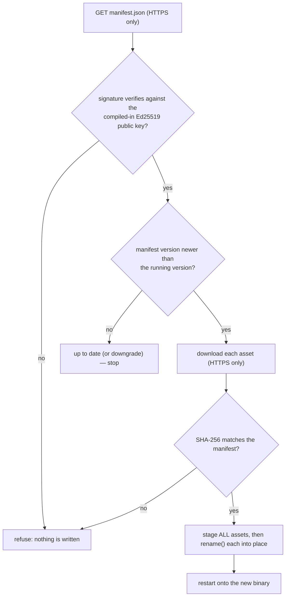

# In-place updates

> **Status.** The mechanism, the signing tool and the client are complete and
> tested (unit tests plus a manual end-to-end run against real `openssl`-signed
> artifacts). **No signed update is published yet**: the GitHub releases now carry
> the `.deb` and the `.rpm`, and `DEFAULT_MANIFEST_URL` points at them, but no
> `manifest.json` is uploaded, so a live check fails cleanly with a download
> error.

EasySearch can update *itself* — over the internet, without a package
manager, and without downloading or installing a `.deb`, `.rpm` or Flatpak. The
running binary is replaced in place and the app restarts onto the new build.

This document is the reference for the mechanism, the trust model, and how to
publish a signed release.

- Implementation: [`core/src/update.rs`](../core/src/update.rs)
- CLI: `easysearch-cli self-update`
- GUI: **Help ▸ Check for updates…**, plus the version in the status bar
  (bottom-right) and a badge when a newer release is known.

## Why not just ship packages?

A distro package is the right *first* install — it puts files where the distro
expects and lets the package manager own them. It is the wrong tool for the
*second* install: it makes every user wait on a repository sync, and it can't
target a user-local install at all. The updater covers that gap with a chain
that is smaller and simpler to reason about than a repository.

## Trust model

An update is *only* applied when the whole chain checks out. Every step fails
closed:



1. **HTTPS only.** `http://` (or anything else) is a hard error, in the client
   *and* in `curl` (`--proto =https --proto-redir =https`). A downgrade is not a
   warning, it is a refusal.
2. **Signed manifest.** `manifest.json.sig` is a detached Ed25519 signature over
   the exact bytes of `manifest.json`, verified against the public key compiled
   into the binary ([`RELEASE_PUBLIC_KEY_HEX`](../core/src/update.rs)). The
   private key never ships.
3. **Pinned hashes.** The manifest lists each asset's SHA-256. Downloads are
   hashed and *must* match before anything is installed.
4. **Only newer versions.** A version that is not strictly newer than the
   running one is never installed.
5. **All-or-nothing staging.** Every asset is downloaded and verified before any
   of them is put in place, so a failed download can never leave a half-updated
   install.
6. **Atomic replace.** Each new binary is copied beside its destination and
   `rename()`d over it. On Linux this is atomic on one filesystem and safe while
   the old binary is still executing (the running inode stays valid until exit).

Nothing is ever *deleted*, and the old binary stays reachable (as an open inode)
until the process exits.

## The manifest

A release publishes two files next to the binaries:

```text
manifest.json
manifest.json.sig
```

`manifest.json`:

```json
{
  "version": "0.15.0",
  "released": "2026-09-26",
  "notes": "Focus follows the pointer; in-place updates.",
  "assets": [
    {
      "name": "easysearch",
      "url": "https://github.com/…/releases/download/v0.15.0/easysearch-x86_64",
      "sha256": "9f2c…(64 hex chars)",
      "size": 18473344,
      "target": "x86_64-unknown-linux-gnu"
    }
  ]
}
```

| Field | Meaning |
| --- | --- |
| `version` | New version (`v` prefix tolerated); compared as dotted numbers, with a release outranking a pre-release of the same core |
| `released` | Informational date |
| `notes` | Free text shown in the update window and by the CLI |
| `assets[].name` | File name **as installed** (must match what is installed, e.g. `easysearch`) |
| `assets[].url` | HTTPS URL of the raw, already-executable binary |
| `assets[].sha256` | Lowercase hex SHA-256 |
| `assets[].size` | Bytes; used for progress and as a sanity check (`0` = unknown) |
| `assets[].target` | Optional target triple; when present it must match this machine |

Assets are **raw binaries**, not archives: the client has no extraction step and
no unpacking attack surface. A typical release ships one asset per binary
(`easysearch`, `easysearch-cli`, `easysearch-gui`, `easysearch-daemon`); the
client installs the ones that are actually installed next to the running
executable.

## Keys

The release key is a standard **Ed25519** keypair. Generate it once:

```sh
mkdir -p ~/.config/easysearch
umask 077
openssl genpkey -algorithm ED25519 \
  -out ~/.config/easysearch/release-signing-key.pem
chmod 600 ~/.config/easysearch/release-signing-key.pem
```

The public half — the raw 32 bytes at the end of the DER `SubjectPublicKeyInfo`,
which is what the client expects — is:

```sh
openssl pkey -in ~/.config/easysearch/release-signing-key.pem \
  -pubout -outform DER | tail -c 32 | od -An -tx1 -v | tr -d ' \n'
```

Put that hex string into `RELEASE_PUBLIC_KEY_HEX` in
[`core/src/update.rs`](../core/src/update.rs) and rebuild. The **private** key
lives outside the repository (the path above is already in the author's
environment, not in git) and must never be committed or shared.

> Losing the private key means you can no longer publish updates users will
> accept; leaking it means anyone can. Keep it in a secret store or an
> offline/HW-backed key.

## Publishing a release

[`scripts/release-sign.sh`](../scripts/release-sign.sh) builds the manifest and
signs it:

```sh
scripts/release-sign.sh 0.15.0              # uses target/release/*
scripts/release-sign.sh 0.15.0 --dir dist  # or a staging directory
```

It writes `dist/manifest.json` and `dist/manifest.json.sig`. Upload both, plus
the binaries, to the release host. Point clients at the manifest with:

- a stable "latest" URL (the default is
  `…/releases/latest/download/manifest.json`), or
- `easysearch-cli self-update --manifest https://…/manifest.json`, or
- `EASYSEARCH_UPDATE_URL`.

## Using it

### GUI

- **Help ▸ Check for updates…** (or **Settings ▸ Updates ▸ Check now…**) opens the
  *Software update* window.
- At launch, a quiet check runs **at most once a day** (disable it with
  **Settings ▸ Updates**, or with `EASYSEARCH_NO_UPDATE=1`). When a newer release
  is found, the status-bar version is joined by a `⬆ v… available` badge.
- **Install update** downloads, verifies, and installs; **Restart now** stops the
  search daemon and relaunches the app detached, so the new binary takes over.

### CLI

```sh
easysearch-cli self-update --check          # report only
easysearch-cli self-update                  # ask, then install
easysearch-cli self-update --yes            # install without asking
easysearch-cli self-update --restart-daemon # also stop the old daemon
easysearch-cli self-update --dir ~/.local/bin
```

## Configuration

| Environment variable | Effect |
| --- | --- |
| `EASYSEARCH_UPDATE_URL` | Manifest URL (self-hosted mirrors, testing) |
| `EASYSEARCH_UPDATE_PUBKEY` | Trusted public key (hex). Setting it means *trusting that key completely* |
| `EASYSEARCH_UPDATE_DIR` | Directory to install into |
| `EASYSEARCH_NO_UPDATE` | Any non-empty value disables checks entirely |

The GUI preference `check_updates` (`~/.config/easysearch/gui.json`)
controls the automatic launch-time check.

## Security notes

- **The daemon API is localhost-only and unauthenticated.** `POST /v1/shutdown`
  therefore lets *any* local process stop the daemon. That is not a privilege
  gain — a local process could already `kill` it — but it is why the endpoint is
  documented rather than hidden.
- **Staging directory.** Downloads land in
  `~/.cache/easysearch/update/*.staged` and are removed after install.
- **Writable install directory required.** If the binaries live somewhere the
  user cannot write (for example a distro-owned `/usr/bin`), `rename()` fails and
  the update is reported as a failure with nothing changed. Use a user-local
  install (`~/.local/bin`) for self-updates, or `--dir`.
- **No rollback.** A verified new binary replaces the old one. Keep a copy of a
  known-good build if you want to roll back by hand.
- **Transport is `curl`.** The engine carries no TLS stack; curl is pinned to
  HTTPS and is expected on any Linux system. If `curl` is missing, updates fail
  before any bytes are trusted.
